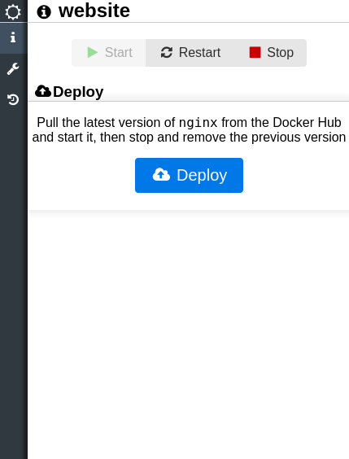
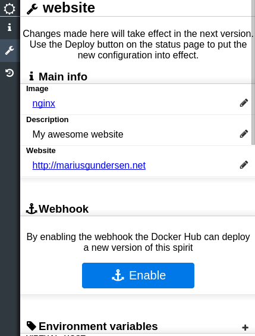
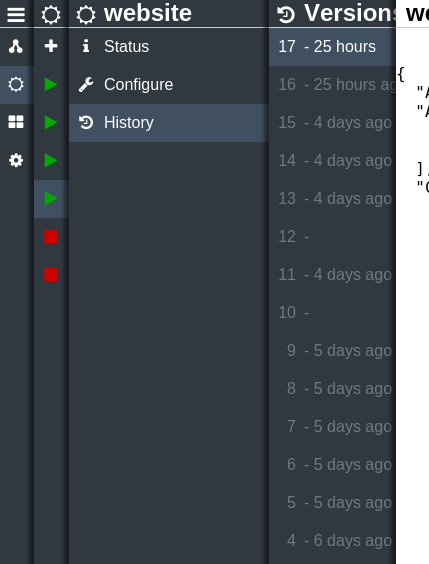

# Samsara

> **Saṃsāra** is a Sanskrit word, the literal meaning of which is "a wandering through" – in reference to the passage through many states of existence that is involved in the endless cycle of death and rebirth

Samsara is a Docker orchestration tool I made for my servers. Samsara runs in a docker container, so all you need to start using it is to run the following command:

```bash
docker run -d --name samsara -p 8080:8080 -v /var/run/docker.sock:/var/run/docker.sock -v /app/config mariusgundersen/samsara
```

You can now log into Samsara using `admin/admin` on http://localhost:8080. By clicking on Containers in the main menu you should see a list of the docker containers on your host. 

## Spirits

Samsara captures the spirit (the soul) of your Docker containers so it can be reincarnated into a new container. With spirits you can easily deploy new versions of your applications with the same settings as the previous version. The web interface lets you create, configure and control your spirits, and you can see the past lifetimes of your spirit as a history of containers. 

## Supported features

* Start, stop, restart and remove containers
* Create a spirit from a container
* Create a spirit based on an image
* Deploy your spirit with a single click, which will pull, create and start a new version before stopping the previous version
* Start, stop and restart a spirit
* Configure the spirit:
  * Image to build from
  * Volumes
  * Environment variables
  * Port bindings
  * Link to other spirits
  * Volumes from other spirits
* Trigger new deploy using [webhooks](https://docs.docker.com/docker-hub/repos/#webhooks)
* View the log history of containers

## Screenshots

### Status


### Configuring


### History
